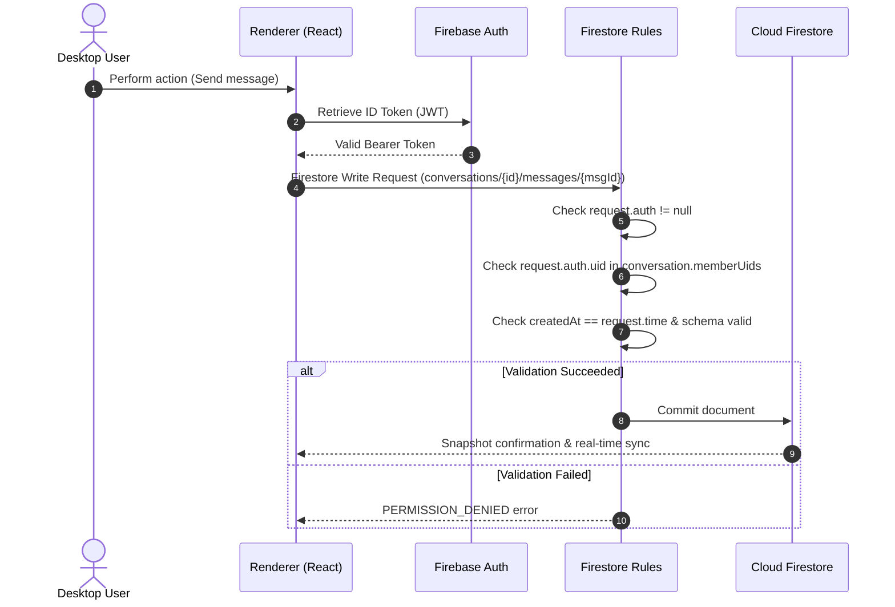
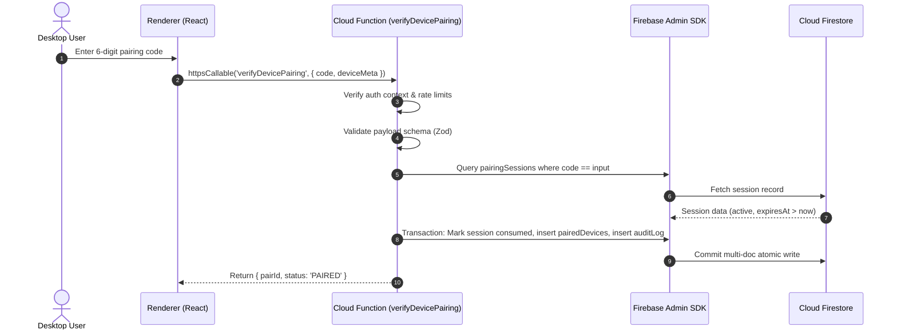

# ComicLink Architecture Specification

## 1. System Overview

ComicLink is a cross-device file-sharing, clipboard synchronization, and community communication platform built with an expressive comic-book and manga visual aesthetic. Designed primarily for desktop environments (with Windows as the initial target) and extensible to mobile, ComicLink blends productivity tools (device pairing, remote file transfer, synchronized clipboard) with community features (comic-panel messaging, community feeds, and asset sharing).

The system operates on a hybrid desktop-and-serverless architecture:
- **Client Tier**: An Electron desktop application featuring an isolated multi-process runtime. The renderer process leverages React, Vite, Tailwind CSS, and a specialized comic UI kit (halftone patterns, bold speech bubbles, dynamic panel grids, onomatopoeic toast notifications).
- **Backend Tier**: A Google Firebase serverless cloud ecosystem consisting of Firebase Authentication for identity, Cloud Firestore for real-time reactive document state, Cloud Storage for binary blob storage, and Cloud Functions for privileged operations, audit logging, and sensitive coordination handshakes.

```
+---------------------------------------------------------------------------------------+
|                                  CLIENT (DESKTOP)                                     |
|                                                                                       |
|  +---------------------------------------------------------------------------------+  |
|  |                       Renderer Process (React + Vite UI)                        |  |
|  |   - Comic-Book UI / Manga Theme Panels                                          |  |
|  |   - Firebase Web Client SDK (Direct Auth, Firestore, Storage)                   |  |
|  |   - Local App State & Cache                                                     |  |
|  +---------------------------------------+-----------------------------------------+  |
|                                          |                                            |
|                               (contextBridge / IPC)                                   |
|                                          v                                            |
|  +---------------------------------------------------------------------------------+  |
|  |                    Preload Layer (Isolated Typed API Bridge)                    |  |
|  +---------------------------------------+-----------------------------------------+  |
|                                          |                                            |
|                                  (Strict IPC Events)                                  |
|                                          v                                            |
|  +---------------------------------------------------------------------------------+  |
|  |                         Main Process (Node.js / Electron)                       |  |
|  |   - Window Lifecycle & Native Menus      - OS File System Streaming             |  |
|  |   - System Tray & Notifications          - Native Clipboard Monitoring          |  |
|  +---------------------------------------------------------------------------------+  |
+------------------------------------------+--------------------------------------------+
                                           |
                              (HTTPS / WSS / gRPC / WebChannel)
                                           |
+------------------------------------------v--------------------------------------------+
|                                FIREBASE BACKEND CLOUD                                 |
|                                                                                       |
|  +---------------------+  +----------------------+  +------------------------------+  |
|  |    Firebase Auth    |  |    Cloud Firestore   |  |        Cloud Storage         |  |
|  |  - Email / Password |  |  - Real-time Sync    |  |  - Encrypted Blob Storage    |  |
|  |  - Identity Tokens  |  |  - Declarative Rules |  |  - Path Security Rules       |  |
|  +----------+----------+  +----------+-----------+  +--------------+---------------+  |
|             |                        |                             |                  |
|             +--------------------+   |   +-------------------------+                  |
|                                  v   v   v                                            |
|                      +-------------------------------+                                |
|                      |        Cloud Functions        |                                |
|                      |  - Pairing Handshakes         |                                |
|                      |  - Append-Only Audit Logging  |                                |
|                      |  - Moderation & Abuse Control |                                |
|                      |  - Background Maintenance     |                                |
|                      +-------------------------------+                                |
+---------------------------------------------------------------------------------------+
```

---

## 2. Component Architecture

The ComicLink desktop application implements Electron's strict multi-process isolation architecture. System responsibilities are decoupled across distinct boundaries to prevent execution leakage and protect native OS resources.

### 2.1 Electron Main Process (`apps/windows/src/main`)
The Main Process executes in a full Node.js runtime and acts as the orchestrator for the desktop environment:
- **Application Lifecycle**: Manages startup, single-instance locking (`app.requestSingleInstanceLock()`), protocol handler registration (`comiclink://`), and graceful shutdown.
- **Window Management**: Instantiates the primary `BrowserWindow` with security flags, manages system tray minimization, custom titlebars, and native window frameless behaviors.
- **Native OS Integrations**:
  - **Clipboard Watcher**: Listens for system clipboard alterations (text, image, rich text) and dispatches synchronized payloads when active.
  - **File System I/O**: Performs local chunked streaming reads and writes for file transfers, bypassing browser memory limits.
  - **System Notifications**: Dispatches native OS notifications formatted with comic sound-effect titles ("BAM!", "POW!").
- **IPC Protocol Dispatcher**: Validates, sanitizes, and fulfills invocations received from the Preload layer.

### 2.2 Preload Script (`apps/windows/src/preload`)
The Preload script bridges the Main Process and Renderer Process while preserving security boundaries:
- **Context Isolation**: Operates in an isolated JavaScript context (`contextIsolation: true`).
- **Surface Exposure**: Uses `contextBridge.exposeInMainWorld('comicLinkApi', { ... })` to expose an explicitly typed, immutable surface.
- **No Node.js Leaks**: Neither `require`, Node globals (`process`, `Buffer`), nor internal Electron modules are exposed to the window DOM.
- **Input Sanitization**: Verifies parameter types and ranges before forwarding IPC messages to the Main Process.

### 2.3 Renderer Process (`apps/windows/src/renderer`)
The Renderer Process runs the single-page web application executing within Chromium:
- **View Layer**: React 18 with modern concurrent features, styled with Tailwind CSS and custom comic-styled components (ink borders, halftone screening, dynamic action bubbles, panel grids).
- **Client Data & Services**:
  - **Firebase Web SDK v10+**: Directly communicates with Firebase Auth, Cloud Firestore, and Cloud Storage over secure WebChannel/gRPC/HTTPS.
  - **Local State**: Context-based and hook-driven stores managing active user session, connected devices, active conversations, real-time message feeds, and pending transfers.
- **Hardware Acceleration**: CSS transforms and WebGL shaders for smooth page transitions mimicking comic page flips.

### 2.4 Firebase Cloud Services
- **Firebase Authentication**: Issues OIDC/JWT access tokens. Users authenticate via email/password or optional Google OAuth. Email verification is verified on critical workflows.
- **Cloud Firestore**: Real-time multi-region document store containing user profiles, device metadata, conversation threads, comic panels, messages, and social feeds. Client access is strictly mediated by security rules.
- **Cloud Storage**: Object storage for comic assets, avatars, attachments, and transferred files. Storage security rules mirror Firestore resource permissions.
- **Cloud Functions (2nd Gen)**: TypeScript functions executing under Firebase Admin SDK. Responsible for tasks requiring elevated privileges, such as validating 6-digit device pairing codes, executing account deletions, triggering abuse reporting actions, and writing append-only audit logs.

---

## 3. Security Architecture

ComicLink applies defense-in-depth across the application lifecycle. The architecture assumes the client execution environment may be hostile or compromised.

```
+-----------------------------------------------------------------------------+
|                            DEFENSE-IN-DEPTH TIERS                           |
+-----------------------------------------------------------------------------+
|  Tier 1: Desktop Client Sandboxing                                          |
|  - contextIsolation: true                                                   |
|  - nodeIntegration: false                                                   |
|  - sandbox: true                                                            |
|  - Content Security Policy (CSP) blocking external scripts & eval           |
|  - Strict IPC whitelist preventing arbitrary command execution              |
+-----------------------------------------------------------------------------+
|  Tier 2: Declarative Cloud Security Rules                                   |
|  - Firestore Security Rules: Schema verification, ownership checks,         |
|    conversation membership verification, server timestamp enforcement       |
|  - Storage Security Rules: Path-based UID isolation, MIME validation,       |
|    payload size ceilings (e.g., max 50MB per single file chunk)             |
+-----------------------------------------------------------------------------+
|  Tier 3: Cloud Functions Privilege Barrier                                  |
|  - Ephemeral pairing code generation, single-use consumption                |
|  - Caller authentication token verification on all callable functions       |
|  - Input validation via shared Zod schemas                                  |
|  - Append-only audit logging via Admin SDK (client write forbidden)         |
+-----------------------------------------------------------------------------+
```

### 3.1 Electron Hardening Specifications
1. **Context Isolation**: Always set to `true`. Ensures preload scripts and renderer code run in completely separate execution contexts.
2. **Node Integration**: Strictly disabled (`nodeIntegration: false`, `nodeIntegrationInWorker: false`). Prevents Cross-Site Scripting (XSS) from escalating into Remote Code Execution (RCE).
3. **Sandboxing**: `sandbox: true` enabled on the browser window to enforce OS-level Chromium sandboxing.
4. **Content Security Policy (CSP)**:
   ```http
   default-src 'self';
   script-src 'self';
   style-src 'self' 'unsafe-inline';
   img-src 'self' data: https://firebasestorage.googleapis.com;
   connect-src 'self' https://*.firebaseio.com https://*.googleapis.com wss://*.firebaseio.com http://localhost:* http://127.0.0.1:*;
   object-src 'none';
   base-uri 'self';
   ```
5. **Navigation & Window Restrictions**:
   - `will-navigate` intercepted to cancel unauthorized redirects.
   - `setWindowOpenHandler` denies all unapproved popups and redirects external links to the OS default browser via `shell.openExternal`.

### 3.2 Cloud Security & Ownership Model
- **Ownership Invariance**: Every mutable Firestore document contains an `ownerUid` or equivalent identity field. Rules enforce `request.auth.uid == resource.data.ownerUid` on mutations.
- **Server Timestamp Enforceability**: Client-supplied timestamps are rejected. All `createdAt` and `updatedAt` properties must match `request.time`.
- **Field Immutability**: Critical identifiers (`id`, `ownerUid`, `createdAt`, `conversationId`) are protected via `request.resource.data.diff(resource.data).affectedKeys().hasAny([...]) == false`.
- **No Client-Side Authorization Decisions**: The UI may show or hide controls based on state, but every backend resource independently verifies permissions on every request.

---

## 4. Data Flow

Data interactions follow two explicit patterns depending on whether the action requires elevated privileges or direct synchronized database access.

### 4.1 Direct Client-to-Firestore Workflow (Standard Operations)
For real-time chats, feeds, profile reads, and file metadata tracking:
1. Client initializes Firebase Web SDK with local configuration.
2. Client authenticates via Firebase Auth, obtaining a secure JWT ID token.
3. Client issues a read/write query to Firestore.
4. Firestore evaluates Declarative Security Rules:
   - Validates `request.auth != null`.
   - Validates resource path ownership or membership array (`request.auth.uid in resource.data.memberUids`).
   - Validates payload attributes against schema constraints.
5. If allowed, Firestore reads or commits data and distributes real-time snapshots to active listeners.



### 4.2 Privileged Operations Workflow (Cloud Functions)
For device pairing handshakes, content moderation reporting, and audit events:
1. Client executes a callable Cloud Function via `httpsCallable(functions, 'verifyDevicePairing')`.
2. Firebase SDK automatically injects the caller's Auth ID token into the request header.
3. Cloud Function middleware verifies caller identity and applies rate-limiting logic.
4. Payload is parsed and validated using `@comiclink/validation` Zod schemas.
5. Cloud Function uses the privileged Firebase Admin SDK to mutate collections (e.g., mark session consumed, create paired device record, write to `auditLogs`).
6. Cloud Function returns structured DTO to the client.



---

## 5. Technology Stack Table

| Layer / Subsystem | Technology | Version | Purpose & Rationale |
| :--- | :--- | :--- | :--- |
| **Desktop Shell** | Electron | ^31.0.0 | Cross-platform desktop runtime, native OS hardware and file system APIs |
| **UI Framework** | React | ^18.3.0 | Declarative component model, concurrent rendering, rich ecosystem |
| **Build Tooling** | Vite | ^5.3.0 | Ultra-fast HMR, optimized ESM bundling for Electron renderer |
| **Language** | TypeScript | ^5.4.0 | Static typing across monorepo packages, compile-time safety |
| **Styling** | Tailwind CSS | ^3.4.0 | Utility-first styling powering ComicLink comic-book visual design |
| **Icons** | Lucide React | ^0.395.0 | Clean, lightweight icon set integrated into comic panel buttons |
| **Desktop Utilities** | electron-builder | ^24.13.0 | Native packaging, code-signing, installer generation for Windows |
| **IPC Concurrency** | concurrently | ^8.2.0 | Orchestrates parallel Vite dev server and Electron launcher |
| **State & Async** | Zustand / Context | ^4.5.0 | Lightweight reactive state management for active session & devices |
| **Client Cloud SDK** | Firebase JS SDK | ^10.12.0 | Client-side Auth, Firestore, and Storage real-time connectivity |
| **Server Cloud SDK** | Firebase Admin SDK| ^12.1.0 | Privileged cloud function executions, transaction control |
| **Serverless Runtime**| Cloud Functions v2 | Node 20 | Serverless backend execution for pairing and background tasks |
| **Testing** | Vitest | ^1.6.0 | Fast, native ESM unit and integration testing across workspaces |
| **Data Validation** | Zod | ^3.23.0 | Isomorphic runtime schema validation shared between client and cloud |

---

## 6. Shared Packages Architecture

To maintain consistency and prevent schema drift between the client applications and the backend Cloud Functions, the repository is structured as an npm monorepo with dedicated shared packages under `/packages`:

```
comiclink/
├── packages/
│   ├── shared-types/     # Canonical interfaces, DTOs, and Firestore document shapes
│   ├── validation/       # Zod schemas matching business rules and Firestore constraints
│   ├── constants/        # Application limits, collection paths, default timeouts
│   └── error-codes/      # Domain error codes and standardized client-friendly messages
├── apps/
│   └── windows/          # Electron + React desktop application
└── backend/
    ├── functions/        # Firebase Cloud Functions (Node 20 / TypeScript)
    ├── firestore/        # firestore.rules and firestore.indexes.json
    └── storage/          # storage.rules
```

### 6.1 Package Responsibilities
- **`@comiclink/shared-types`**: Declares TypeScript interfaces for all domain entities: `UserRecord`, `DeviceRecord`, `PairingSession`, `Conversation`, `Message`, `FileTransferRecord`, and `AuditLogEntry`. Contains no runtime dependencies.
- **`@comiclink/validation`**: Implements isomorphic Zod schemas for all client-to-server payloads and Firestore document shapes. Ensures identical validation rules execute in both the React UI and Cloud Functions.
- **`@comiclink/constants`**: Houses invariant system parameters, including collection names, maximum file sizes (50MB chunks), rate limits, pairing session timeouts (300 seconds), and UI animation tokens.
- **`@comiclink/error-codes`**: Centralizes error enums (e.g., `AUTH_DEVICE_UNPAIRED`, `PAIRING_CODE_EXPIRED`, `FILE_QUOTA_EXCEEDED`) allowing uniform UI error displays and localized messages.

---

## 7. Future Considerations & Roadmap

1. **Android & Mobile Support**:
   - The shared packages (`shared-types`, `validation`, `constants`, `error-codes`) are designed to be consumed by a future React Native or Kotlin Android client.
   - Mobile-specific pairing will consume the same `pairingSessions` collection via QR-code scanning of the desktop session ID.
2. **Firebase App Check (Phase 7)**:
   - Introduce App Check to enforce that only verified, untampered ComicLink clients can reach Firebase services.
   - Integration with Windows custom attestation providers, reCAPTCHA Enterprise, and Google Play Integrity for Android.
3. **Advanced Rate Limiting**:
   - Transition Cloud Functions rate limiting from Firestore transactions to an in-memory/Redis distributed token bucket for high-throughput endpoints.
4. **End-to-End Encryption (E2EE)**:
   - Implement Web Cryptography API (SubtleCrypto) key pair generation per device.
   - Direct device-to-device file transfers and private messaging will encrypt payloads client-side before transmission through Firestore or Storage.
